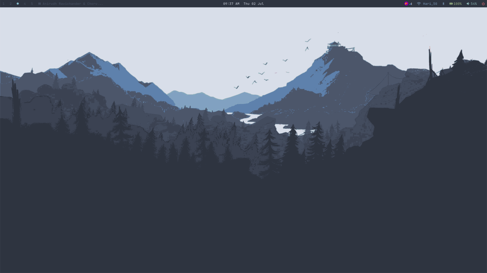
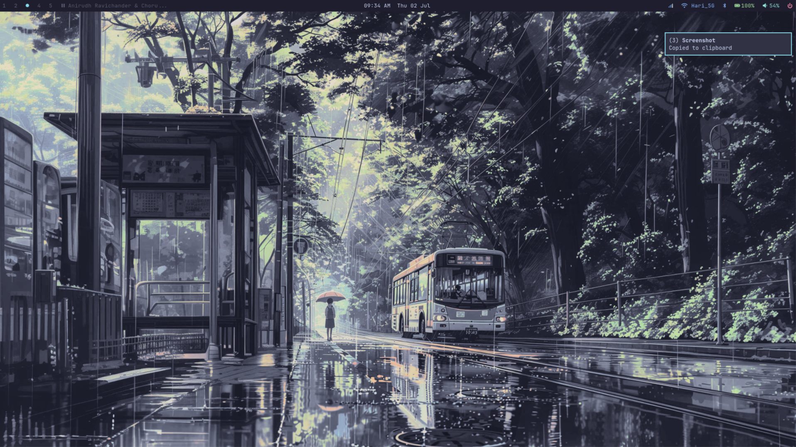
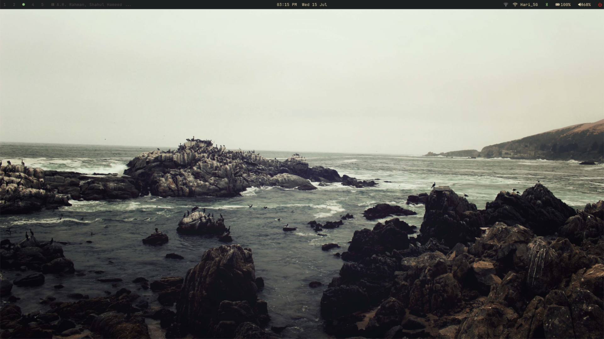
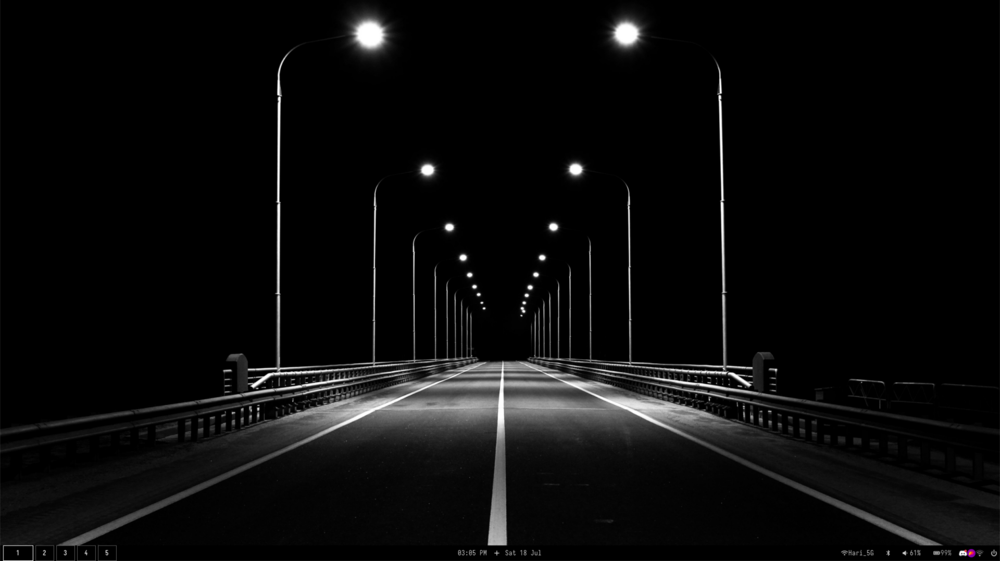
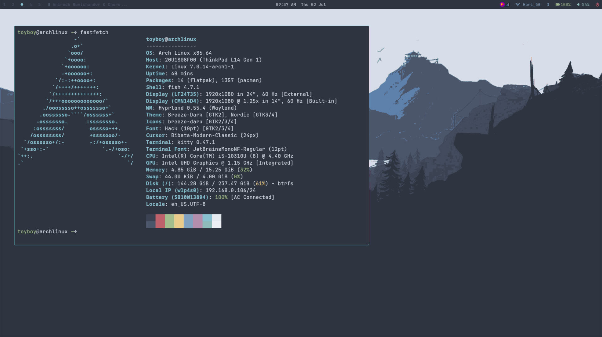
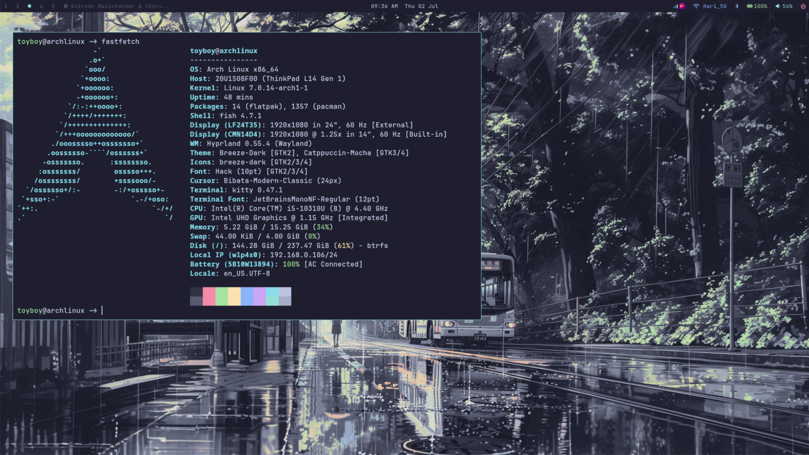
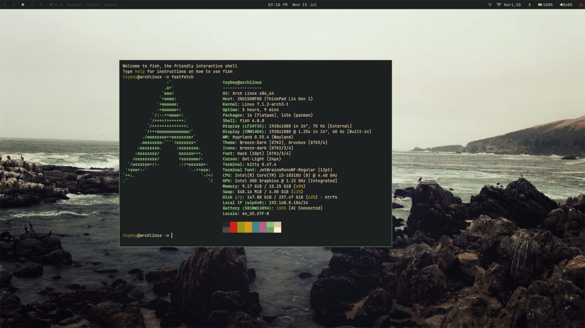
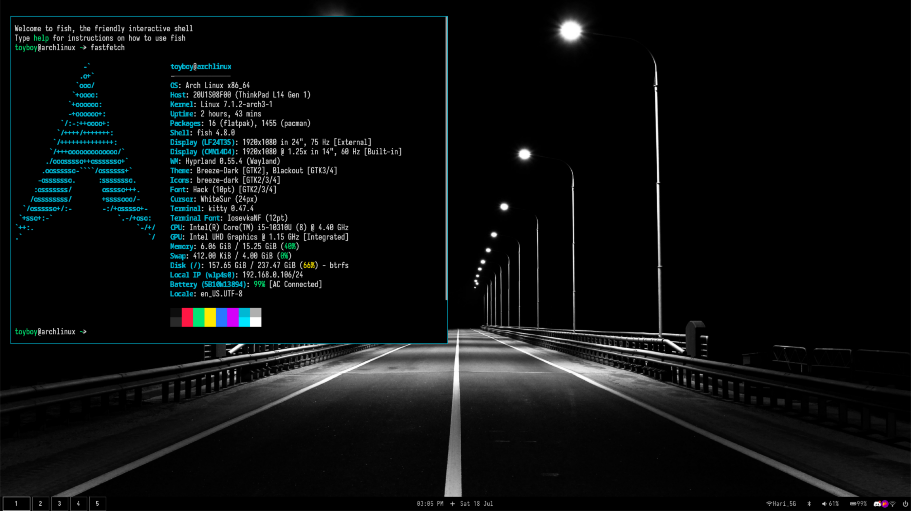

# Hyprland Config

A minimal Hyprland rice with Nord, Catppuccin Mocha, Gruvbox Dark & Monochrome themes.

## Themes

| Nord | Catppuccin Mocha | Gruvbox Dark | Monochrome |
|---|---|---|---|
|  |  |  |  |
|  |  |  |  |

## Features

- **Hyprland** — Lua config (0.55+), Omarchy-inspired keybinds
- **Waybar** — workspace dots/numbers, clock (12h), network, battery, volume, bluetooth, tray, mpd now-playing, power menu
- **Rofi** — 2-column launcher + powermenu
- **Kitty** — terminal with theme-matching ANSI colors
- **Dunst** — notification daemon
- **mpd + rmpc** — music player with album art notifications
- **swaybg** — wallpaper (switches with theme)
- **Flameshot** — `Super+Shift+S` region screenshot → clipboard
- **Night light** — `Super+N` toggles hyprsunset (4500K)
- **Theme switcher** — `Super+Shift+T` cycles Nord ↔ Catppuccin Mocha ↔ Gruvbox Dark ↔ Monochrome (colors, wallpapers, GTK theme, Brave theme, Waybar style)
- **Bluetooth** — rofi-based scan/pair/connect/disconnect
- **System tray** — toggle arrow in Waybar
- **Adwaita** — white macOS-style cursor for dark backgrounds

## Keybinds

Press `Super+K` for the full list in-app.

| Key | Action |
|---|---|
| `Super+Return` | Terminal |
| `Super+Space` | Launcher |
| `Super+Q` | Close window |
| `Super+F` | Fullscreen |
| `Super+N` | Night light toggle |
| `Super+Shift+W` | Cycle wallpaper |
| `Super+Shift+S` | Screenshot region |
| `Super+Shift+M` | Music (rmpc) |
| `Super+Shift+T` | Theme menu |
| `Super+Shift+F` | File manager |
| `Super+1-5` | Switch workspace |
| `Super+Shift+1-5` | Move to workspace |

## Installation

**Arch Linux only.**

```bash
git clone https://github.com/pr-hari-jayanth/hyprland-config-lua.git ~/dotfiles
cd ~/dotfiles
./install.sh
```

The script will:
1. Install all packages (Hyprland, Waybar, Rofi, Kitty, Dunst, mpd, rmpc, etc.)
2. Install AUR packages (bibata-cursor-theme-bin, hyprsunset)
3. Download Nordic, Catppuccin Mocha & Gruvbox GTK themes
4. Clone wallpaper repos (nordic-wallpapers, walls-catppuccin-mocha, gruvbox-wallpapers)
5. Symlink config files into `~/.config/`
6. Enable services (bluetooth, mpd)

Reboot or restart Hyprland after install.

## Cursor

Adwaita — set via env, GTK settings, xsettingsd, and gsettings.

## Monitor Layout

- **HDMI-A-1** (external): workspaces 1-3
- **eDP-1** (laptop): workspaces 4-5
- Laptop scale: 1.25x
- External scale: 1x
